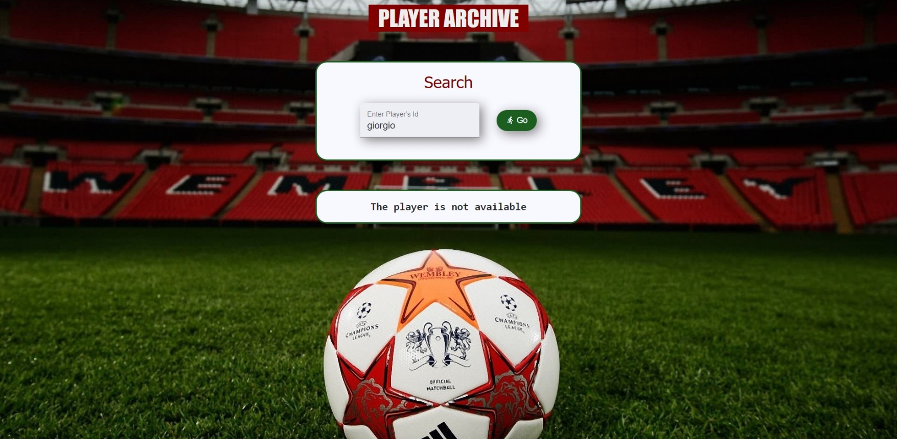
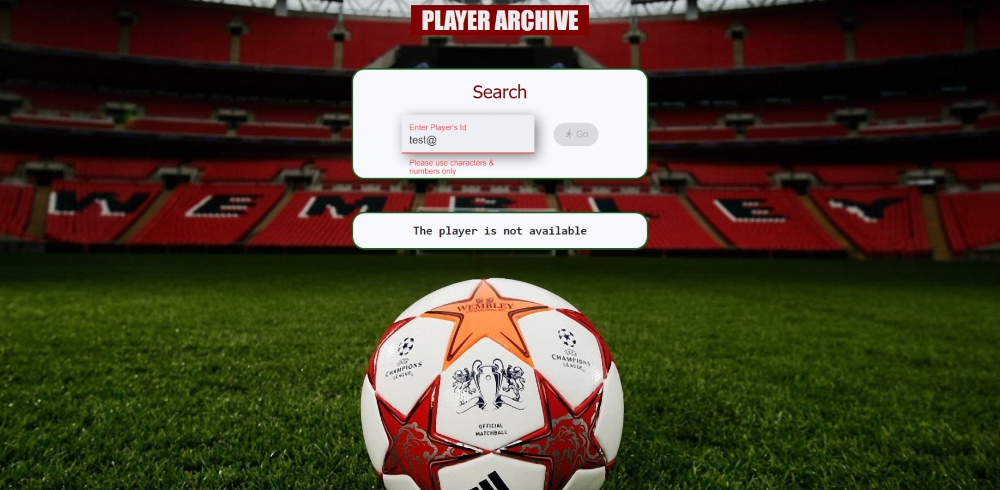

# PlayerArchive

The goal	of this	project	is to create a simple player archive

- A simple search form is used for searching the player with the name/id
 

- After search, player's information is displayed if the player is in active status (player:FABIO) 

- If the player is inactive(player: GIORGIO/FRANCESCO), or if there is no such player in the database(any random text), then a not found message will be dispalyed

<strong> View the site here - <a target="_blank" href="https://divyabharathimanimaran.github.io/player-archive">Player Archive</a></strong>
 
 
 

 Landing page

 Test data: 

 1. fabio (Success scenario - player info displayed)

 2. giorgio (Success scenario - player not found displayed)

 3. any random text (Failure scenario + Validations) 

This project was generated with [Angular CLI](https://github.com/angular/angular-cli) version 12.1.1.

## Development server

Run `ng serve` for a dev server. Navigate to `http://localhost:4200/`. The app will automatically reload if you change any of the source files.

## Code scaffolding

Run `ng generate component component-name` to generate a new component. You can also use `ng generate directive|pipe|service|class|guard|interface|enum|module`.

## Build

Run `ng build` to build the project. The build artifacts will be stored in the `dist/` directory.

## Running unit tests

Run `ng test` to execute the unit tests via [Karma](https://karma-runner.github.io).

## Running end-to-end tests

Run `ng e2e` to execute the end-to-end tests via a platform of your choice. To use this command, you need to first add a package that implements end-to-end testing capabilities.

## Further help

To get more help on the Angular CLI use `ng help` or go check out the [Angular CLI Overview and Command Reference](https://angular.io/cli) page.
